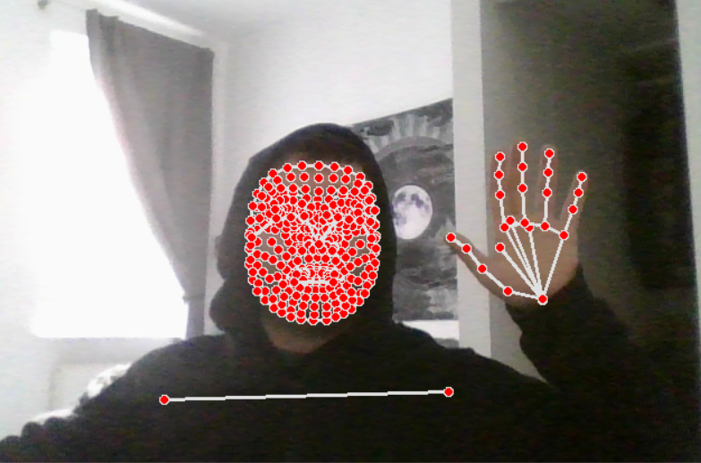

### British Sign Langage Detection

### Contents of this file

- Introduction
- Dependicies
- Data Acqusition
- Model Training
- Results

**Introduction**

This repo aims to create a British Sign Language detection algoritm with using MediaPipe Holistic pipeline to estimate mimic poses and train ML model with those mimics with using Long Short-Term Memory (LSTM) networks.

## Dependicies

- mediapipe
- numpy
- opencv
- sklearn
- scikit_learn

 PS:These dependicies can be installed with using ***requirements.txt*** file.

## Data Acqusition

To train or NN model, a huge amount of data need to be collected, to achieve this I have used mediapipe PL and OpenCV to capture videos of 30 frames while doing some BSL mimics. These mimics include 'hello&bye','u_need_help','I_need_help','how_are_you','good','morning','afternoon','night' and 'name'. I have collected 15 videos for each mimic and save my poses as numpy arrays.

You can collect data by running the pose_stream.py with following command.

```ruby
python3 pose_stream.py
```

the data capturing process will be started by running this command. and then you can start posing for different mimics.



## Model Training

After the data acqusition process, all the data is collected and stored inside the Np_Data folder. You can then create your training and testing set, NN model and start training. to do this; run data_struct.py.

```ruby
python3 data_struct.py.
```

This will create our traing and test set and our Neural Network model with 6 layers. Then we will train and save our model. In this case, my saved model can be found in this repo as well (my_model.h5)

## Results

Finally, the real_time_detection.py can be used to see the results in real time.


